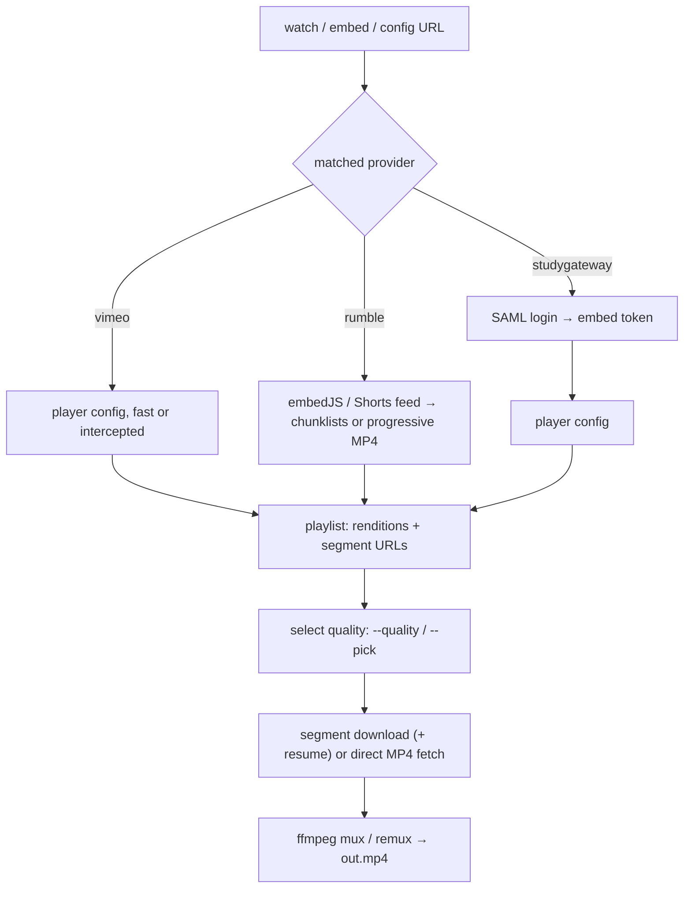

# titanium-video-downloader

A CLI that downloads streaming videos you have access to — StudyGateway (full login), public Vimeo, public Rumble — into local MP4 files. One tool, one pipeline, one video or a whole batch list at a time: resolve where the video lives, fetch its segments over plain HTTPS, and mux them into an MP4. No browser extensions, no screen recording, no re-encoding.

## What this project actually does

Streaming sites don't hand you a video file; they hand your browser a *recipe* for assembling one (a config URL, a playlist, a few hundred segment files). This tool speaks that recipe language directly: give it a watch-page URL and it logs in where needed, collects the segment URLs, downloads them concurrently with resume, and muxes them into a seekable MP4 with the original quality intact.

| Site | Auth | How it resolves | Status |
| --- | --- | --- | --- |
| StudyGateway (VHX OTT) | Full login (SAML + reCAPTCHA-proof browser harvest) | Watch slug → embed iframe token → 60s player config → DASH playlist | ✅ working |
| Vimeo public (+unlisted) | None needed | Watch page → player config (fast path) or headless Play-click intercept (strict videos) → DASH playlist | ✅ working |
| Rumble public (watch + shorts) | None needed | Watch page → video key → embedJS metadata (shorts: page feed JSON) → HLS-TS segments → concat remux (tar variant) or direct progressive MP4 (mp4 variant, all quality levels) | ✅ working |
| RightNow Media | Login (planned) | Stub only — needs a login-flow + DRM probe first | 🔲 slot |
| Unknown login site | Login (planned) | Generic fallback slot — blocked on DRM probe first | 🔲 slot |
| YouTube | — | Deferred, no module | 🔲 deferred |

Here's how a download flows, whichever site you start from:



---

## Why it's built this way

A few choices in this repo are deliberate, and worth understanding rather than just copying:

**The browser harvests URLs; `requests` does the downloading.**
A headless Chromium (Playwright) is used *only* to get past the parts that require a real browser — SAML login with reCAPTCHA, Vimeo's minted player tokens, Cloudflare-gated pages. The moment URLs are in hand, everything moves back to plain `requests`: concurrent, resumable, observable. Browsers are slow tenants; we evict them as early as possible.

**Tokens are minted and consumed live, never pasted.**
Player config tokens live ~60 seconds (StudyGateway) to ~1 hour (Vimeo); playlist URLs ~1.5 hours. The pipeline resolves → fetches → downloads back-to-back inside those windows, which is why watch-page URLs are the reliable input and pasted config URLs are inherently fragile.

**One provider pattern, explicit capabilities.**
Every site implements `match()` / `login()` / `resolve_embed()`, plus two markers: `site_key` (drives per-site credential names) and `requires_auth` (gates `--no-auth` fail-fast). New sites plug in without touching the pipeline; the RightNow Media and unknown-site stubs show the shape.

**Prints today, event bus tomorrow.**
All user output is still `print`s — stdout carries *results* (file paths, listings, JSON), stderr carries *diagnostics* (notes, progress, debug). That's already the contract a future event bus will formalize for GUI front-ends, which is why `--list-qualities-json` output is machine-clean today.

**ffmpeg is bundled-first, system second.**
`imageio-ffmpeg` (pinned static build) resolves first, system ffmpeg is the fallback, `--ffmpeg-path` overrides both. One known wart, documented not hidden: the pinned 7.0.2-static build segfaults in its TS demuxer on some files (Rumble segments), while system ffmpeg handles them — the remuxer retries across binaries automatically and says so.

---

## Features

**Three sites, one tool.** StudyGateway with your own login, public Vimeo (including unlisted links), and public Rumble (including Shorts) — all through the same command. You hand it a watch-page URL and get back a seekable MP4 in the video's original quality, with no browser extensions, no screen recording, and no re-encoding.

**See what you're getting before you download.** List every available quality with its real download size first, then pick exactly — a height label, the best published, or an interactive numbered picker. If the quality you asked for doesn't exist, the tool says what it's doing instead (nearest quality below), fails cleanly, or asks you — your choice, set once and forgotten.

**Hand it a list and walk away.** A batch file is just URLs with optional qualities, one per line. The tool works through them in order with a single shared login per site, skips files you already have (so re-runs retry only failures), keeps going when one video fails, and finishes with a plain-English tally — how many succeeded, skipped, and failed. The exit code is the failure count, so scripts can trust it.

**Logins that sort themselves out.** There is no login mode to choose: sites that need you get a real browser login (which sails through bot checks), public sites skip it. Your credentials live in environment variables or a `.env` file, saved logins can be reused from your own browser's cookie export, and public videos never ask for anything. Every run says what it decided, in redacted form — never your secrets.

**Set it once, stop typing flags.** Default quality, download folders, login behavior — all of it lives in one `config.toml`, and anything you pass on the command line still wins for that run. A `--print-config` command shows the effective setup and where each value came from, so there's never a mystery about what the tool thinks you asked for.

**Resumable, checked, and honest.** Downloads show live progress and survive interruption — rerunning picks up where it stopped, not from zero. Disk space is verified before a byte is fetched, existing files are never overwritten, and failures say what happened plus what to do (re-export stale cookies, point at the right `.env`, free up disk) instead of dumping a traceback.

---

## What's inside the project folder

```
titanium-video-downloader/
├── titanium_video_downloader/
│   ├── cli.py                 argparse front-end + orchestration (ti22-video-dl)
│   ├── __main__.py            python -m titanium_video_downloader
│   ├── core/
│   │   ├── session.py         UA/headers/timeouts, per-site credentials, cookies
│   │   ├── browser.py         shared Chromium singleton (batch amortization)
│   │   ├── batch.py           batch file parse/dedupe/ledger helpers
│   │   ├── disk.py            download estimates + split space gates
│   │   ├── envfile.py         stdlib .env loader, titanium-software/ti22-video-dl defaults
│   │   ├── appconfig.py       config.toml layering (CLI > env > file > builtins)
│   │   ├── models.py          playlist parse, quality select/labels, size totals
│   │   ├── fetcher.py         JSON/text fetch, concurrent segments + resume, HLS chunklists
│   │   ├── mux.py             ffmpeg mux + TS concat remux (with fallback)
│   │   ├── paths.py           ffmpeg binary resolution (--ffmpeg-path > bundled > PATH)
│   │   └── naming.py          portable filenames (Windows-reserved set)
│   └── extractors/
│       ├── base.py            AuthError, shared provider base, registry, redacted debug
│       ├── studygateway.py    SAML + browser harvest + embed/config resolve
│       ├── vimeo.py           clip regex, fast config, Play-click intercept, privacy gate
│       ├── rumble.py          watch→key→embedJS, muxed-HLS + progressive-mp4 renditions, gated-origin bootstrap
│       ├── rightnowmedia.py   stub — match real, rest waits for probe
│       └── generic.py         fallback slot for the unknown site
├── tests/                     182 offline tests (no network): parsers, auth, login stubs + fail-fast waiter,
│                              no-auth matrix, env/.env/config.toml, per-site cookies, quality, remux, ffmpeg resolve,
│                              batch ledger, rumble variants, direct download
├── ti22_video_dl.py           thin shim so `python ti22_video_dl.py ...` keeps working
├── pyproject.toml             titanium-video-downloader 0.1.0, ti22-video-dl script,
│                              browser/ffmpeg/test extras
├── ARCHITECTURE.md            decision log — update it when statuses above change
└── README.md
```

---

## Setting it up on your own computer

### Step 1: Clone the repository

Requires [Git](https://git-scm.com/) and Python 3.12.

```bash
mkdir -p ~/apps && cd ~/apps
git clone <your-remote-url> titanium-video-downloader
cd titanium-video-downloader
```

### Step 2: Create the environment and install

Requires [uv](https://docs.astral.sh/uv/) (or `pip`, if you prefer).

```bash
uv venv --python 3.12 .venv
uv pip install --python .venv/bin/python -e ".[test,browser,ffmpeg]"
```

Or with plain `pip`:

```bash
python3.12 -m venv .venv
.venv/bin/pip install -e ".[test,browser,ffmpeg]"
```

This installs the package editable with all three extras: `browser` (Playwright, for logins and strict-site harvests), `ffmpeg` (pinned static binary, so muxing works with zero setup), `test` (pytest).

### Step 3: Install the browser (once)

```bash
.venv/bin/playwright install chromium
```

Downloads Chromium into the shared per-user cache (reused across projects). Only needed for StudyGateway login, strict Vimeo videos, and Cloudflare-gated Rumble fetches — lax/public paths never launch a browser.

### Step 4: Run the automated tests

```bash
.venv/bin/python -m pytest tests/ -q
```

This runs the 182 offline tests — parsers, auth markers, stubbed logins, credential precedence, quality math, remux fallback. No network involved. If they pass, the plumbing is sound; live downloads are a separate check (tokens expire, sites change shape).

---

## Trying it out

**StudyGateway (needs login once — browser handles the reCAPTCHA):**

```bash
export TI22_VIDEO_DL_STUDYGATEWAY_EMAIL='you@example.com'
read -s TI22_VIDEO_DL_STUDYGATEWAY_PASSWORD; export TI22_VIDEO_DL_STUDYGATEWAY_PASSWORD
.venv/bin/ti22-video-dl "https://watch.studygateway.com/.../videos/<slug>" -o "talk.mp4"
```

**Public Vimeo or Rumble (no account, no flags):**

```bash
.venv/bin/ti22-video-dl "https://vimeo.com/123456789" -o "clip.mp4"
.venv/bin/ti22-video-dl "https://rumble.com/vabc123-title.html" --list-qualities
```

**Picking quality:**

```bash
.venv/bin/ti22-video-dl "<url>" --list-qualities        # human table (sizes are estimated totals)
.venv/bin/ti22-video-dl "<url>" --list-qualities-json   # JSON array for scripts/front-ends
.venv/bin/ti22-video-dl "<url>" --pick -o "clip.mp4"    # interactive numbered picker
.venv/bin/ti22-video-dl "<url>" --quality 720p -o "clip.mp4"
.venv/bin/ti22-video-dl "<url>" --quality 480p -o "clip.mp4"   # missing quality → 360p fallback, announced
.venv/bin/ti22-video-dl "<url>" --quality 480p --on-missing-quality=fail
.venv/bin/ti22-video-dl "<url>" --quality 480p --on-missing-quality=ask  # full list + skip, TTY only
```

No `--quality` means `best` — literally the highest video quality published (2160p/4K where offered, e.g. some Rumble mp4s); check `--list-qualities` sizes first when bandwidth matters.

**Batch downloads** (sequential, one shared session + browser):

```bash
# batch.txt: "URL [QUALITY]" per line, # comments and blanks ignored
.venv/bin/ti22-video-dl --batch-file batch.txt --output-dir ./series
# CLI URLs combine with the file (file entries first), dupes collapse
.venv/bin/ti22-video-dl --batch-file batch.txt "https://vimeo.com/123" --no-auth
```

Each entry resolves with its own quality (line value, else `--quality`, else best), existing outputs skip with a note (re-runs retry only failures), one video's failure never stops the batch, and the run ends with an `ok/skipped/failed` ledger — exit code is the failure count. Disk is gated upfront on summed estimates, then re-checked per video. `--pick` prompts per video on TTY; `--list-qualities` modes stay single-download.

`size` everywhere means estimated *total* download (video quality + the selected audio rendition, container overhead excluded) — an upper bound, typically landing within ~5% above the final file.

---

## Credentials & Auth

Login is automatic, never a decision: auth-required sites (StudyGateway) always harvest via browser; public sites (Vimeo, Rumble) skip unless given explicit creds. `--no-auth` asserts skipping on no-auth sites (explicit creds/cookies/prefer/headed alongside it are an error); on auth sites it fails fast by name. CLI `--no-auth` beats a config `no_auth = true`, and explicit CLI login options beat that too. Cookie files are a debug/dev tool (default off): `--cookies` one exclusive file, or per-site env + `--prefer-cookies`; each entry uses cookies only when the jar actually holds that site's cookies, else normal login.

Precedence for every site: `--email` / `--password` flags → `TI22_VIDEO_DL_<SITE>_*` env vars → interactive password prompt (email known + terminal). No generic fallback by design. Values are never logged; `--debug-login` prints only redacted metadata (`cred_source=flag|site-env|prompt|missing`, cookie *names*).

| Variable pattern | Example | For |
| --- | --- | --- |
| `TI22_VIDEO_DL_<SITE>_EMAIL` / `TI22_VIDEO_DL_<SITE>_PASSWORD` | `TI22_VIDEO_DL_STUDYGATEWAY_EMAIL` | One site (`STUDYGATEWAY`, `VIMEO`, `RUMBLE`, `RIGHTNOWMEDIA`, `GENERIC`) |
| `TI22_VIDEO_DL_<SITE>_COOKIES` | `TI22_VIDEO_DL_STUDYGATEWAY_COOKIES` | Per-site cookies file (used only with `--prefer-cookies`/`prefer_cookies`) |
| `TI22_VIDEO_DL_CONFIG_DIR` | — | Overrides the config dir location |

Optional `.env` file (flat `KEY=VALUE`, real environment always wins): `./.env` first, then the app config dir's `.env` — `~/.config/titanium-software/ti22-video-dl/.env` on Linux and macOS (no `~/Library` special-casing), `%APPDATA%\titanium-software\ti22-video-dl\.env` on Windows. Every run announces which file it loaded, so two locations never confuse again.

## Config file

`config.toml` (same config dir as `.env`) holds your defaults so the flags stop growing. Precedence: CLI flag → environment → `config.toml` → built-in. Credentials never live here (env-only, by design).

```toml
quality = "720p"              # default: "best" = literal highest video quality
on_missing_quality = "fallback"  # fallback | fail | ask
concurrency = 4
ffmpeg_path = "/usr/bin/ffmpeg"
output_dir = "~/videos/batch" # ~-expanded
temp_dir = "~/videos/tmp"
keep_intermediate = false
no_space_check = false
debug_login = false
headed = false
no_auth = false
pick_always = false           # config-only: prompt the picker every resolve
prefer_cookies = false        # consult per-site TI22_VIDEO_DL_<SITE>_COOKIES files
```

Unknown keys, wrong types, and malformed TOML never fail a run — a `note:` names the key and it's ignored. `--pick` forces picking (even over `pick_always = false`); `--no-pick` forces it off (even over `true`); `pick_always` on a non-terminal notes and falls back to default quality. `--config PATH` points at another file; `--print-config` dumps effective values + sources as JSON and exits.

| Situation | What to do |
| --- | --- |
| Bot check blocks password login | `--cookies sg.txt` (exclusive Netscape export; only sites with entries in it use cookies, others auth normally) |
| Wrong email/password | Fast failure naming the site's rejection (no 90s wait) |
| Per-site cookie files (debug/dev) | `TI22_VIDEO_DL_<SITE>_COOKIES=~/cookies/sg.txt` + `--prefer-cookies` (or config `prefer_cookies`); relative names resolve CWD first, then the config dir; sites without a file auth normally; stale files warn at load, failures name re-export |
| 2FA / CAPTCHA / headed debugging | `--headed` (visible browser wherever one runs; also lifts a config `no_auth=true` block for the run) |
| Just verifying auth + resolve | `--login-only` (prints the resolved URL, exits) |
| Site needs no login | Nothing — or `--no-auth` to assert it (auth-required sites fail fast naming themselves; `--no-auth` + `--prefer-cookies`/`--cookies` together is an error) |
| Diagnosing login flow | `--debug-login` (redacted URLs, parse flags, auth markers) |

---

## CLI flag reference

Every flag, grouped by job. `config.toml` can default the flags (quality, concurrency, dirs, login behavior); CLI flags always win. Passing any value-taking flag with a blank value fails like a bad flag (exit 2).

**Inputs & Batch**

| Flag | What it does |
| --- | --- |
| `inputs` (positional) | One video URL (an optional second positional is the output path), or several URLs = a batch (then use `--output-dir`) |
| `--batch-file FILE` | `URL [QUALITY]` per line, `#` comments and blanks ignored; combined with CLI URLs (file entries first); malformed lines fail fast |
| `-o, --output PATH` | Output MP4 path. Single-download only; a bare filename joins under `--output-dir`, a dir-ful path wins outright |

**Quality Selection**

| Flag | What it does |
| --- | --- |
| `--quality Q` | Height label (`720p`), `best` (= highest video quality), or rendition id prefix |
| `--pick` | Interactive numbered picker, then download (terminal only) |
| `--no-pick` | Never prompt for quality (overrides config `pick_always`) |
| `--on-missing-quality MODE` | `fallback` = nearest quality below, announced; `fail` = error out; `ask` = full list + skip option (terminal only) |
| `--list-qualities` | Human table on stdout, then exit |
| `--list-qualities-json` | JSON array on stdout, then exit (scripts/front-ends) |

**Output & Storage**

| Flag | What it does |
| --- | --- |
| `--output-dir DIR` | Root for auto-named outputs and bare `-o` filenames (default: cwd) |
| `--temp-dir DIR` | Root for intermediate `.ti22` workdirs (default: beside the output) |
| `--no-space-check` | Skip the disk-space gates (unreadable NAS/cloud drives) |
| `--keep-intermediate` | Keep segment parts and intermediates instead of deleting them |

**Download Engine**

| Flag | What it does |
| --- | --- |
| `-j, --concurrency N` | Parallel segment downloads (default: 4) |
| `--ffmpeg-path PATH` | Explicit ffmpeg binary (default: bundled static build, then system `PATH`) |

**Auth & Login** (login itself is automatic — these only steer it)

| Flag | What it does |
| --- | --- |
| `--email / --password` | Credentials for this run (beat per-site env vars) |
| `--cookies FILE` | One exclusive Netscape cookies export; each entry uses it only when the jar actually holds that site's cookies |
| `--prefer-cookies` | Prefer per-site `TI22_VIDEO_DL_<SITE>_COOKIES` files over normal login (or config `prefer_cookies`) |
| `--no-auth` | Skip login (no-auth sites; auth sites fail fast naming themselves; an error alongside login flags) |
| `--headed` | Visible browser window wherever one runs (login harvest, Vimeo intercept; also lifts a config `no_auth=true` block for the run) |
| `--login-only` | Login + resolve, print the resulting URL, exit |
| `--debug-login` | Redacted login diagnostics (URLs, parse flags, cookie names, challenge hits) |

**Config & Introspection**

| Flag | What it does |
| --- | --- |
| `--config PATH` | Use this `config.toml` instead of the app config dir's |
| `--print-config` | Print effective values + sources as JSON, then exit |

---

## Tools used

- Python `==3.12.*`, stdlib + [`requests`](https://requests.readthedocs.io/) (+ optional [`tqdm`](https://tqdm.tqdm.pro/))
- [`playwright`](https://playwright.dev/python/) 1.62 (`browser` extra) — URL harvesting only, never downloading
- [`imageio-ffmpeg`](https://github.com/imageio/imageio-ffmpeg) 0.6.0 → ffmpeg 7.0.2-static (`ffmpeg` extra), system ffmpeg fallback
- [`pytest`](https://pytest.org/) 9 (`test` extra) — 182 offline tests
- `uv` for environments, `git` for everything else

---

## Limitations (honest ones)

- **Public-only, except StudyGateway.** No livestreams (rejected cleanly), no private/password videos outside StudyGateway (gated with clear errors), no DRM — a DRM-walled site is a hard stop, not an engineering task.
- **Sites change shape.** Selectors, form fields, and player internals drift; the offline suite pins *our* logic, live runs are the real check. Fresh failures deserve a DevTools look before a code look.
- **Cloudflare-gated origins** (Rumble) need the browser bootstrap path; pure-`requests` returns 403 there by design.
- **The pinned static ffmpeg segfaults** in its TS demuxer on some files — the remuxer falls back to system ffmpeg automatically and says so. Upstream report pending.
- **Refusal (not overwrite)** on name collision — single runs fail, batch entries skip with a note.
- **Disk space is preflighted, not assumed** — the tool estimates the download, checks both the temp and output filesystems, and refuses before downloading a single byte when short (override with `--no-space-check`, e.g. for NAS/cloud drives that can't be stat'ed). `--output-dir` and `--temp-dir` (RAM drives welcome) control where outputs and intermediates land; a bare `-o` filename joins under `--output-dir`, a dir-ful `-o` wins outright.

Only download content you have the rights to. This tool is built for your own videos and openly licensed material.

## Roadmap

- Event bus (`events.py`) — the GUI prerequisite; `--list-qualities-json`'s stdout discipline is the down payment
- RightNow Media probe (login flow + DRM check), then implementation
- Batch pipeline parallelism (download N+1 while muxing N) — batch ships sequential
- PyInstaller per-OS bundles (`ti22-video-dl` + Chromium + ffmpeg, built natively per platform)
- YouTube — deferred, deliberately

## License

Licensed under the [MIT](LICENSE) license.
