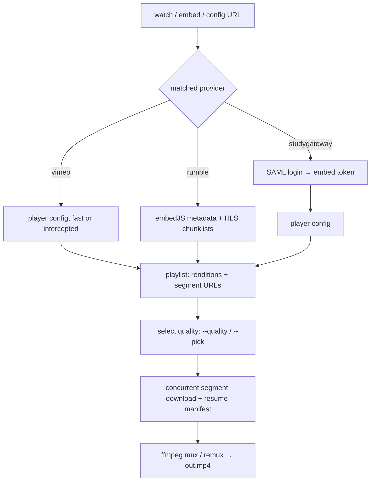

# titanium-video-downloader

A CLI that downloads streaming videos you have access to — StudyGateway (full login), public Vimeo, public Rumble — into local MP4 files. One tool, one pipeline, one download at a time: resolve where the video lives, fetch its segments over plain HTTPS, and mux them into an MP4. No browser extensions, no screen recording, no re-encoding.

## What this project actually does

Streaming sites don't hand you a video file; they hand your browser a *recipe* for assembling one (a config URL, a playlist, a few hundred segment files). This tool speaks that recipe language directly: give it a watch-page URL and it logs in where needed, collects the segment URLs, downloads them concurrently with resume, and muxes them into a seekable MP4 with the original quality intact.

| Site | Auth | How it resolves | Status |
| --- | --- | --- | --- |
| StudyGateway (VHX OTT) | Full login (SAML + reCAPTCHA-proof browser harvest) | Watch slug → embed iframe token → 60s player config → DASH playlist | ✅ working |
| Vimeo public (+unlisted) | None needed | Watch page → player config (fast path) or headless Play-click intercept (strict videos) → DASH playlist | ✅ working |
| Rumble public | None needed | Watch page → video key → embedJS metadata → HLS-TS segments → concat remux | ✅ working |
| RightNow Media | Login (planned) | Stub only — needs a login-flow + DRM probe first | 🔲 slot |
| Unknown login site | Login (planned) | Generic fallback slot — blocked on DRM probe first | 🔲 slot |
| YouTube | — | Deferred, no module | 🔲 deferred |

Here's how a download flows, whichever site you start from:



---

## Why it's built this way

A few choices in this repo are deliberate, and worth understanding rather than just copying:

**The browser harvests URLs; `requests` does the downloading.**
A headless Chromium (Playwright) is used *only* to get past the parts that require a real browser — SAML login with reCAPTCHA, Vimeo's minted player tokens, Cloudflare-gated pages. The moment URLs are in hand, everything moves back to plain `requests`: concurrent, resumable, observable. Browsers are slow tenants; we evict them as early as possible.

**Tokens are minted and consumed live, never pasted.**
Player config tokens live ~60 seconds (StudyGateway) to ~1 hour (Vimeo); playlist URLs ~1.5 hours. The pipeline resolves → fetches → downloads back-to-back inside those windows, which is why watch-page URLs are the reliable input and pasted config URLs are inherently fragile.

**One provider ABC, explicit capabilities.**
Every site implements `match()` / `login()` / `resolve_embed()`, plus two flags: `site_key` (drives per-site credential names) and `requires_auth` (gates `--no-auth` fail-fast). New sites plug in without touching the pipeline; stubs for Vimeo-already-built, RightNow Media, and the unknown slot show the shape.

**Prints today, event bus tomorrow.**
All user output is still `print`s — stdout carries *results* (file paths, listings, JSON), stderr carries *diagnostics* (notes, progress, debug). That's already the contract a future event bus will formalize for GUI front-ends, which is why `--list-qualities-json` output is machine-clean today.

**ffmpeg is bundled-first, system second.**
`imageio-ffmpeg` (pinned static build) resolves first, system ffmpeg is the fallback, `--ffmpeg-path` overrides both. One known wart, documented not hidden: the pinned 7.0.2-static build segfaults in its TS demuxer on some files (Rumble segments), while system ffmpeg handles them — the remuxer retries across binaries automatically and says so.

---

## What's inside the project folder

```
titanium-video-downloader/
├── titanium_video_downloader/
│   ├── cli.py                 argparse front-end + orchestration (ti22-video-dl)
│   ├── __main__.py            python -m titanium_video_downloader
│   ├── core/
│   │   ├── session.py         UA/headers/timeouts, per-site credentials, cookies
│   │   ├── envfile.py         stdlib .env loader, titanium-software/ti22-video-dl defaults
│   │   ├── models.py          playlist parse, quality select/labels, size totals
│   │   ├── fetcher.py         JSON/text fetch, concurrent segments + resume, HLS chunklists
│   │   ├── mux.py             ffmpeg mux + TS concat remux (with fallback)
│   │   ├── paths.py           ffmpeg binary resolution (--ffmpeg-path > bundled > PATH)
│   │   └── naming.py          portable filenames (Windows-reserved set)
│   └── extractors/
│       ├── base.py            AuthError, AuthProvider ABC, registry, redacted debug
│       ├── studygateway.py    SAML + browser harvest + embed/config resolve
│       ├── vimeo.py           clip regex, fast config, Play-click intercept, privacy gate
│       ├── rumble.py          watch→key→embedJS, muxed-HLS renditions, gated-origin bootstrap
│       ├── rightnowmedia.py   stub — match real, rest waits for probe
│       └── generic.py         fallback slot for the unknown site
├── tests/                     86 offline tests (no network): parsers, auth, login stubs,
│                              no-auth matrix, env/.env, quality, remux, ffmpeg resolve
├── ti22_video_dl.py           thin shim so `python ti22_video_dl.py ...` keeps working
├── pyproject.toml             titanium-video-downloader 0.1.0, ti22-video-dl script,
│                              browser/ffmpeg/test extras
├── ARCHITECTURE.md            decision log — update it when statuses above change
└── README.md
```

---

## Setting it up on your own computer

### Step 1: Clone the repository

Requires [Git](https://git-scm.com/) and Python 3.12.

```bash
git clone <your-remote-url> titanium-video-downloader
cd titanium-video-downloader
```

### Step 2: Create the environment and install

Requires [uv](https://docs.astral.sh/uv/) (or `pip`, if you prefer).

```bash
uv venv --python 3.12 .venv
uv pip install --python .venv/bin/python -e ".[test,browser,ffmpeg]"
```

This installs the package editable with all three extras: `browser` (Playwright, for logins and strict-site harvests), `ffmpeg` (pinned static binary, so muxing works with zero setup), `test` (pytest).

### Step 3: Install the browser (once)

```bash
.venv/bin/playwright install chromium
```

Downloads Chromium into the shared per-user cache (reused across projects). Only needed for StudyGateway login, strict Vimeo videos, and Cloudflare-gated Rumble fetches — lax/public paths never launch a browser.

### Step 4: Run the automated tests

```bash
.venv/bin/python -m pytest tests/ -q
```

This runs the 86 offline tests — parsers, auth markers, stubbed logins, credential precedence, quality math, remux fallback. No network involved. If they pass, the plumbing is sound; live downloads are a separate check (tokens expire, sites change shape).

---

## Trying it out

**StudyGateway (needs login once — browser handles the reCAPTCHA):**

```bash
export TI22_VIDEO_DL_STUDYGATEWAY_EMAIL='you@example.com'
read -s TI22_VIDEO_DL_STUDYGATEWAY_PASSWORD; export TI22_VIDEO_DL_STUDYGATEWAY_PASSWORD
.venv/bin/ti22-video-dl "https://watch.studygateway.com/.../videos/<slug>" --use-browser-login -o "talk.mp4"
```

**Public Vimeo or Rumble (no account, no flags):**

```bash
.venv/bin/ti22-video-dl "https://vimeo.com/123456789" -o "clip.mp4"
.venv/bin/ti22-video-dl "https://rumble.com/vabc123-title.html" --list-qualities
```

**Picking quality:**

```bash
.venv/bin/ti22-video-dl "<url>" --list-qualities        # human table (sizes are estimated totals)
.venv/bin/ti22-video-dl "<url>" --list-qualities-json   # JSON array for scripts/front-ends
.venv/bin/ti22-video-dl "<url>" --pick -o "clip.mp4"    # interactive numbered picker
.venv/bin/ti22-video-dl "<url>" --quality 720p -o "clip.mp4"
```

`size` everywhere means estimated *total* download (video rung + the selected audio rendition, container overhead excluded) — an upper bound, typically landing within ~5% above the final file.

---

## Credentials and auth

Precedence for every site: `--email` / `--password` flags → `TI22_VIDEO_DL_<SITE>_*` env vars → interactive password prompt (email known + terminal). No generic fallback by design. Values are never logged; `--debug-login` prints only redacted metadata (`cred_source=flag|site-env|prompt|missing`, cookie *names*).

| Variable pattern | Example | For |
| --- | --- | --- |
| `TI22_VIDEO_DL_<SITE>_EMAIL` / `TI22_VIDEO_DL_<SITE>_PASSWORD` | `TI22_VIDEO_DL_STUDYGATEWAY_EMAIL` | One site (`STUDYGATEWAY`, `VIMEO`, `RUMBLE`, `RIGHTNOWMEDIA`, `GENERIC`) |
| `TI22_VIDEO_DL_CONFIG_DIR` | — | Overrides the config dir location |

Optional `.env` file (flat `KEY=VALUE`, real environment always wins): `./.env` first, then `~/.config/titanium-software/ti22-video-dl/.env` (`%APPDATA%\titanium-software\ti22-video-dl\.env` on Windows).

| Situation | What to do |
| --- | --- |
| Bot check blocks password login | `--cookies cookies.txt` (Netscape export of a logged-in browser) |
| 2FA / CAPTCHA / headed debugging | `--use-browser-login --headed` |
| Just verifying auth + resolve | `--login-only` (prints the resolved URL, exits) |
| Site needs no login | Nothing — or `--no-auth` to assert it (auth-required sites fail fast naming themselves) |
| Diagnosing login flow | `--debug-login` (redacted URLs, parse flags, auth markers) |

---

## Tools used

- Python `==3.12.*`, stdlib + [`requests`](https://requests.readthedocs.io/) (+ optional [`tqdm`](https://tqdm.tqdm.pro/))
- [`playwright`](https://playwright.dev/python/) 1.62 (`browser` extra) — URL harvesting only, never downloading
- [`imageio-ffmpeg`](https://github.com/imageio/imageio-ffmpeg) 0.6.0 → ffmpeg 7.0.2-static (`ffmpeg` extra), system ffmpeg fallback
- [`pytest`](https://pytest.org/) 9 (`test` extra) — 86 offline tests
- `uv` for environments, `git` for everything else

---

## Limitations (honest ones)

- **Public-only, except StudyGateway.** No livestreams (rejected cleanly), no private/password videos outside StudyGateway (gated with clear errors), no DRM — a DRM-walled site is a hard stop, not an engineering task.
- **Sites change shape.** Selectors, form fields, and player internals drift; the offline suite pins *our* logic, live runs are the real check. Fresh failures deserve a DevTools look before a code look.
- **Cloudflare-gated origins** (Rumble) need the browser bootstrap path; pure-`requests` returns 403 there by design.
- **The pinned static ffmpeg segfaults** in its TS demuxer on some files — the remuxer falls back to system ffmpeg automatically and says so. Upstream report pending.
- **Single downloads only** — no batch mode yet; one URL per run, one output file, refusal (not overwrite) on name collision.
- **Disk space is preflighted, not assumed** — the tool estimates the download, checks both the temp and output filesystems, and refuses before downloading a single byte when short (override with `--no-space-check`, e.g. for NAS/cloud drives that can't be stat'ed). `--output-dir` and `--temp-dir` (RAM drives welcome) control where outputs and intermediates land; a bare `-o` filename joins under `--output-dir`, a dir-ful `-o` wins outright.

Only download content you have the rights to. This tool is built for your own videos and openly licensed material.

## Roadmap

- Event bus (`events.py`) — the GUI prerequisite; `--list-qualities-json`'s stdout discipline is the down payment
- RightNow Media probe (login flow + DRM check), then implementation
- Batch/series downloads (persistent browser across videos, per-file determinism)
- PyInstaller per-OS bundles (`ti22-video-dl` + Chromium + ffmpeg, built natively per platform)
- YouTube — deferred, deliberately

## License

Licensed under the [MIT](LICENSE) license.
